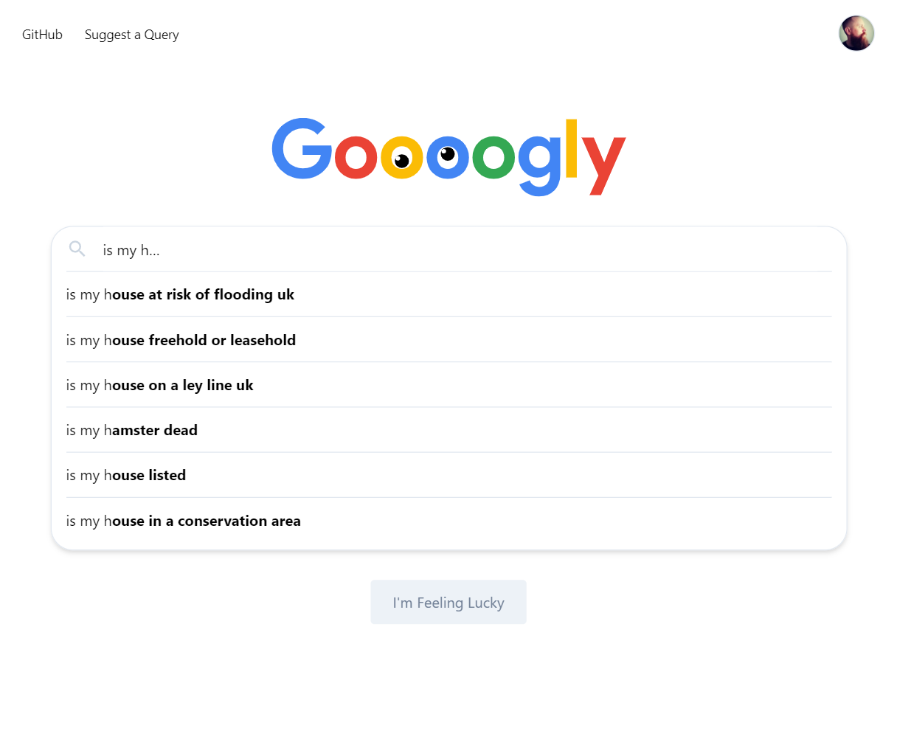

# Goooogly
A simple game using Google autocomplete where a series of queries are sent to Google to suggest results and players can then guess the top results.

<table><tr><td>
    
</td></tr></table>

## Contributing

If you would like to contribute additional queries to the pool of Goooogly queries, you can submit a PR against the [queries collection](https://github.com/mattbrailsford/goooogly/edit/master/data/queries.js).

## License

Copyright 2019 Matt Brailsford

Project is licensed under the [MIT license](LICENSES)
